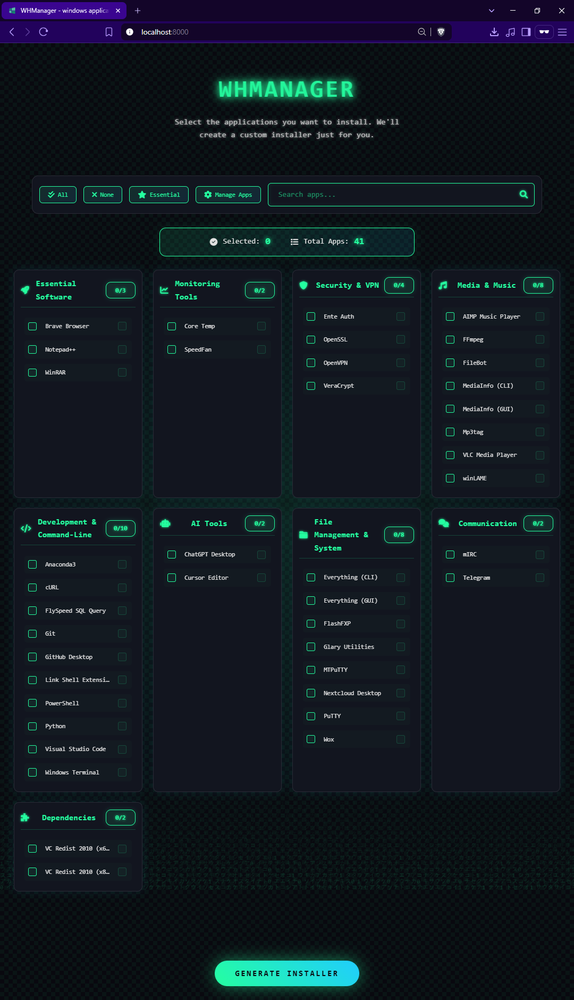
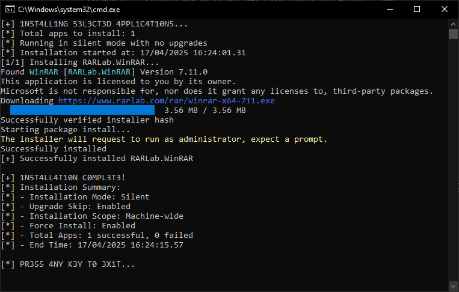

# WHManager

<div align="center">


[](https://opensource.org/licenses/MIT)

A modern, web-based Windows application management system that provides a Ninite-like experience using winget.

[Features](#features) • [Installation](#installation) • [Usage](#usage) • [Screenshots](#screenshots) • [Development](#development)

</div>

## 📸 Screenshots

<div align="center">
  
  <p><em>Main Interface - Browse and select applications to install</em></p>
  
  
  <p><em>Installation Progress - Track installation status in real-time</em></p>
</div>

## ✨ Features

- 🚀 Beautiful web interface for application management
- 📦 Automated installation using winget
- 🗂️ Categorized software management
- 🔄 Hotfix capabilities for system updates
- 📝 Detailed installation logging
- ⚡ Fast and efficient installation process
- 🔒 Administrative privilege management
- 📊 Installation status tracking

## 📑 Categories

- Essential Software
- Monitoring Tools
- Security & VPN
- Media & Music
- Development & Command-Line
- AI Tools
- File Management & System
- Communication
- Dependencies

## ⚙️ Requirements

- Windows 10/11
- winget (Windows Package Manager)
- Administrative privileges
- Modern web browser
- Python 3.x (for running the local server)

## 🚀 Installation

1. Clone the repository:
```bash
git clone https://github.com/elirancv/WHManager.git
cd WHManager
```

2. Run the hotfix script to ensure winget is properly installed:
```powershell
.\hotfix\Install-WinGet.ps1
```

3. Start the local web server:
```bash
cd src/web
python server.py
```

4. Open your web browser and navigate to:
```
http://localhost:8000/index.html
```

## 💻 Usage

1. Launch WHManager through the web interface at `http://localhost:8000/index.html`
2. Browse through the categorized applications
3. Select the applications you want to install
4. Click "Install" to begin the installation process
5. Monitor the installation progress through the interface

## 👩‍💻 Development

### Running the Development Server

1. Navigate to the web directory:
```bash
cd src/web
```

2. Start the development server:
```bash
python server.py
```

3. Access the application at `http://localhost:8000/index.html`

### Running Tests

```bash
python -m pytest tests/
```

## 📁 Project Structure

```
WHManager/
├── docs/               # Documentation
│   └── screenshots/   # Application screenshots
├── hotfix/            # System update scripts
├── src/               # Source code
│   ├── web/          # Web interface files
│   │   ├── index.html
│   │   ├── apps_manager.html
│   │   ├── apps_config.json
│   │   └── server.py
│   └── scripts/      # Installation scripts
├── config/            # Configuration files
├── tests/             # Test files
└── README.md          # Project documentation
```

## 🤝 Contributing

Contributions are welcome! Please feel free to submit a Pull Request. See our [Contributing Guidelines](docs/CONTRIBUTING.md) for details.

## 📄 License

This project is licensed under the MIT License - see the [LICENSE](LICENSE) file for details.

## 🙏 Acknowledgments

- Inspired by Ninite
- Built with winget
- Modern web technologies

---

<div align="center">
  <sub>Built with ❤️ by <a href="https://github.com/elirancv">Eliran Cohen</a></sub>
</div> 